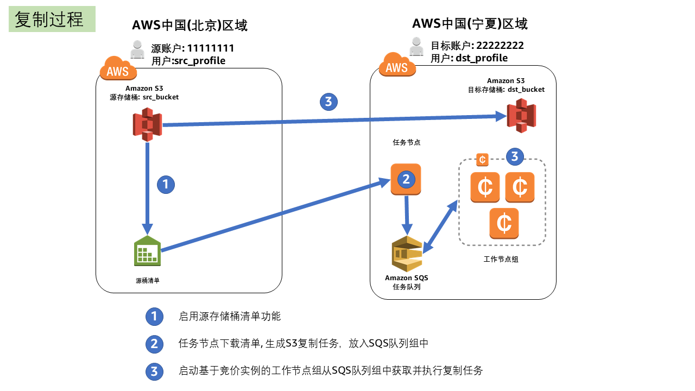
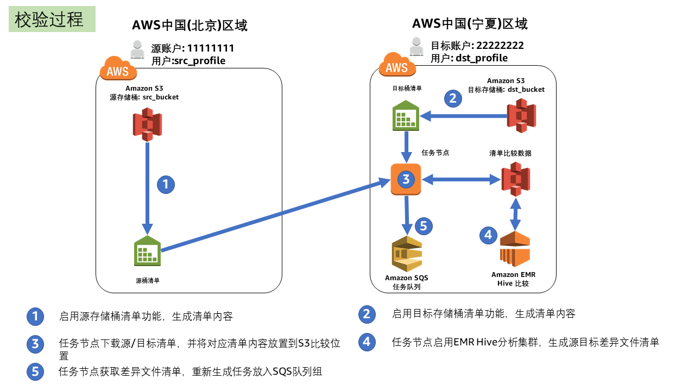
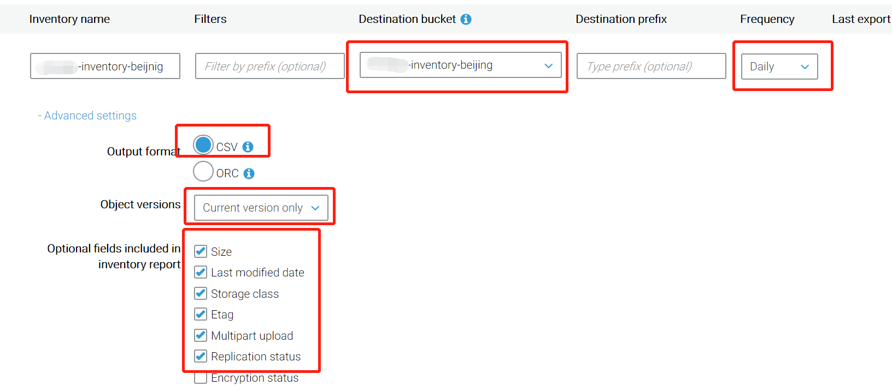

# S3 Mass Migration
S3迁移框架 *更新时间: 2018/10/11*
- AWS中国区域大规模S3数据迁移工具

## 免责说明
建议测试过程中使用此方案，生产环境使用请自行考虑评估。<br>
当您对方案需要进一步的沟通和反馈后，可以联系 nwcd_labs@nwcdcloud.cn 获得更进一步的支持。<br>
欢迎联系参与方案共建和提交方案需求, 也欢迎在 github 项目issue中留言反馈bugs。

## 项目说明
完成海量数据通过公网方式迁入AWS的S3, 提供高效可扩展的复制架构, 完整的复制过程监控和数据复制有效性确认。
### 计划支持数据源
- [X] AWS中国区域
- [ ] AWS全球区域
### 计划支持的数据目的地
- [X] AWS中国区域: [官网](https://www.amazonaws.cn/?nc1=h_ls)
- [ ] AWS全球区域: [官网](https://aws.amazon.com/)

### 复制过程

### 验证过程



## FAQ
- 问：什么时候用这个方案?<br>
数据已经在AWS中国区域的S3上，想要完成跨区域数据迁移,文件数量较多(>10000), 数据量较多(>1T),同步时间要求高(<6小时), 可以采用此复制方案。

- 问：可以此利用方案将海外AWS上的S3数据迁移到国内吗？<br>
暂时还不支持。此方案现在支持同一账号体系(AWS中国)内，EC2上数据不落地的S3存储桶之间直接复制。

- 问：可以利用此方案将自建数据中心海量数据迁移上AWS的S3上吗?<br>
暂时数据来源还不支持自建数据中心。可以采用[AWS Snowball](https://aws.amazon.com/snowball/)将海量数据迁移入AWS。

- 问：可以利用此方案将其他云厂商对象存储数据迁移上AWS的S3上吗?<br>
暂时还不支持。

## 提前准备
1. 启动源S3存储桶上的[清单功能](https://docs.aws.amazon.com/zh_cn/AmazonS3/latest/dev/storage-inventory.html)

2. 创建源账户上的IAM用户，具备访问下载源存储桶清单文件权限，例如用户名：src_profile
```Base
[TODO] IAM sample policies
```
3. 创建目标账户上的IAM角色task_role，具备SQS创建/读/写, EC2创建/销毁，CloudFormation使用等功能。
```Base
[TODO] IAM sample policies
```
4. 创建目标账户上的IAM角色work_role，具备源S3存储桶读,目标S3存储桶写，本账号SQS读写等权限。
```Base
[TODO] IAM sample policies
```
## 操作步骤(TODO)
 1. 启动宁夏区域S3-Mass-Migrate任务节点模版
 
    AWS Region   | YAML Format 
    ------------ | ------------
    宁夏区域 | [](https://console.amazonaws.cn/cloudformation/home?region=cn-northwest-1#/stacks/new?stackName=EasyVPNServer&amp;templateURL=https://s3.cn-northwest-1.amazonaws.com.cn/nwcdlabs/templates/easy-vpc-peering/EasyVPN_Server.yaml)
 2. 创建任务列表
  - 登陆任务节点
  - 创建任务SQS队列组
    ```Bash
    # cd /root/s3-mass-ListProducer
    # ./install.sh
    ```
  - 定义复制任务job.json
    ```Bash
    # 例子
	{
		"src": {
			"profile": "src_profile",
			"type": "s3_inventory",
			"bucket": "reinvent",
			"inventory_bucket": "chinakb-inventory-beijing",
			"inventory_manifest_dir": "reinvent/chinakb-inventory-beijnig/2018-09-16T08-00Z/"
		},
		"dst": {
			"profile": "dst_profile",
			"bucket": "leo-zhy-reinvent",
			"inventory_bucket": "leo-zhy-inventory-bucket",
			"inventory_manifest_dir": "reinvent/chinakb-inventory-beijnig/2018-09-16T08-00Z/"
		},
		"queue" : {
			"url_prefix": "https://sqs.cn-northwest-1.amazonaws.com.cn/xxx62002xxxx/s3sync-worker",
			"num": 10,
			"message_body_max_num": 100
		},
		"job_bucket": "leo-zhy-tasks",
		"job_dir": "test-migration"
	}
    ```
  - 生成任务清单
  ```Bash
  #./start.sh
  ...
  ============
    {u'creationTimestamp': u'1537084800000',
    u'destinationBucket': u'arn:aws-cn:s3:::chinakb-inventory-beijing',
    u'fileFormat': u'CSV',
    u'fileSchema': u'Bucket, Key, Size, LastModifiedDate, ETag, StorageClass, IsMultipartUploaded, ReplicationStatus',
    u'files': [{u'MD5checksum': u'5214b8f5204016433ab72190458b1a90',
                u'key': u'reinvent/chinakb-inventory-beijnig/data/c4d12bf5-c162-4665-b1a0-f92b6cb2040e.csv.gz',
                u'size': 204647},
                {u'MD5checksum': u'4b1f5cb1c89d968e3b99f9570faf1bee',
                u'key': u'reinvent/chinakb-inventory-beijnig/data/d9dba75e-082f-4415-8394-97a06c3ba81e.csv.gz',
                u'size': 25239}],
    'job_info': {u'dst_bucket': u'leo-zhy-reinvent',
                u'dst_profile': u'dst_profile',
                u'inventory_bucket': u'chinakb-inventory-beijing',
                u'inventory_manifest_dir': u'reinvent/chinakb-inventory-beijnig/2018-09-16T08-00Z/',
                u'job_bucket': u'leo-zhy-tasks',
                u'job_dir': u'test-migration',
                u'message_body_max_num': 100,
                u'queue_num': 10,
                u'queue_url_prefix': u'https://sqs.cn-northwest-1.amazonaws.com.cn/358620020600/s3sync-worker',
                u'src_bucket': u'reinvent',
                u'src_profile': u'src_profile',
                u'src_type': u's3_inventory'},
    u'sourceBucket': u'reinvent',
    'statistics': {'totalObjects': 7900,
                    'totalObjectsSub100GB': 5705,
                    'totalObjectsSub10GB': 864,
                    'totalObjectsSub1GB': 131,
                    'totalObjectsSub1TB': 7888,
                    'totalObjectsSub50GB': 4643,
                    'totalObjectsSub5GB': 650,
                'totalObjectsSub5TB': 7900,
                'totalSize': 982465935136},
    u'version': u'2016-11-30'}
    === Job description is at s3://leo-zhy-tasks/test-migration/job_stat.json
  ```
 3. 启动宁夏区域工作节点模版
 
    AWS Region   | YAML Format 
    ------------ | ------------
    北京区域 | [](https://console.amazonaws.cn/cloudformation/home?region=cn-north-1#/stacks/new?stackName=EasyVPNClient&amp;templateURL=https://s3.cn-northwest-1.amazonaws.com.cn/nwcdlabs/templates/easy-vpc-peering/EasyVPN_Client.yaml)
 4. 监控复制进程
    ```Bash
    # tail -f /root/s3-mass-migration/logs/check_sqs.log
    Fri Sep 21 17:54:19 UTC 2018: 8000
    Fri Sep 21 18:18:03 UTC 2018: 4200
    Fri Sep 21 18:54:20 UTC 2018: 0
    Fri Sep 21 19:54:20 UTC 2018: 0
    Fri Sep 21 20:54:20 UTC 2018: 0
    Fri Sep 21 21:54:21 UTC 2018: 0
    Fri Sep 21 22:54:21 UTC 2018: 0
    Fri Sep 21 23:54:21 UTC 2018: 0
    Sat Sep 22 00:54:22 UTC 2018: 0
    Sat Sep 22 01:54:22 UTC 2018: 0
    Sat Sep 22 02:54:22 UTC 2018: 0
    Sat Sep 22 03:54:22 UTC 2018: 0
    Sat Sep 22 04:54:23 UTC 2018: 0
    Sat Sep 22 05:42:29 UTC 2018: 8000
    Sat Sep 22 06:12:30 UTC 2018: 0
    Sat Sep 22 06:42:30 UTC 2018: 0
    Sat Sep 22 07:12:30 UTC 2018: 0
    Sat Sep 22 07:42:31 UTC 2018: 0
    ```

## 参考
- [Amazon S3 清单功能](https://docs.aws.amazon.com/zh_cn/AmazonS3/latest/dev/storage-inventory.html)
- [AWS Cloudformation Templates](https://github.com/awslabs/aws-cloudformation-templates)
- [Using the AWS Command Line Interface](https://docs.aws.amazon.com/AWSCloudFormation/latest/UserGuide/cfn-using-cli.html)
